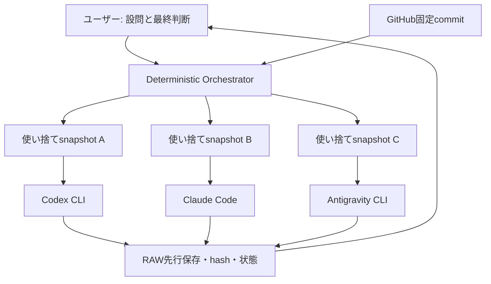

# Multi-AI Council 自動化調査完全版（CLI・ブラウザ・先行実装）

> **状態:** PRIVATE DRAFT / ラウンド担当への未開示資料  
> **調査日:** 2026-09-17  
> **用途:** R5-B前後にユーザー判断で開示する追加証拠。R5-A回答の事後改変には使用しない。  
> **重要:** 本文は公開GitHubへ置くまで非公開扱い。公開repoのbranch、PR、Issue、commitへ置けば未Mergeでも第三者から閲覧可能であり、「ラウンド担当に見せない」を保証できない。

## 0. 結論

現時点の第一候補は、**三社の公式CLIを、判断を行わないvendor-neutral Orchestratorから呼び出すハイブリッドCLI方式**である。

- OpenAI席: ChatGPT契約で認証した公式Codex CLI
- Anthropic席: Claude契約で認証した公式Claude Code
- Google席: Google AI Proで認証した公式Antigravity CLI
- Orchestrator: 配布、固定commit展開、hash、timeout、quota確認、RAW先行保存、失敗記録だけを担当
- 人間: 危険操作、Merge、最終採用

ブラウザCouncilは、人間のコピペを直接消し、既存のWeb契約を使える点では魅力的である。しかし、**DOM変更、規約、cookie・他タブ権限、prompt injection、完了判定、スマホ非対応**が同時に残る。特にChatGPT Web出力の自動抽出はOpenAI利用規約との衝突懸念が強い。したがって、ブラウザ方式は本番の第一経路ではなく、公式CLIが成立しない席の限定bridge、または設計研究用と位置づける。

ただし、三社CLIのWindows実機での安定性、長文RAW完全読取、subscription認証のままの非対話実行、利用枠消費は未実測である。よって最終判定は **CLI優先・条件付き採用候補、実機試験必須**。

## 1. 「ラウンド担当に見せずGitHubへ置く」は可能か

### 判定

| 保管方法 | 担当AIからの非開示 | 備考 |
|---|---:|---|
| 公開Council repoのmain | 不可 | 即時公開 |
| 同じ公開repoのbranch | 不可 | branch一覧・commit URL・Gitオブジェクトから発見可能 |
| 同じ公開repoのDraft PR | 不可 | PR自体が公開 |
| 同じ公開repoのIssue/Discussion/Gist | 不可 | 公開設定なら閲覧可能 |
| private repo | 条件付き可 | そのrepoへのアクセス権をラウンド担当に与えないこと |
| ローカル／Libraryで保管 | 可 | 公開前の凍結に最適 |
| 暗号化ファイルを公開repoへ置く | 非推奨 | 内容は隠せても存在・時刻・サイズが漏れ、鍵管理も増える |

**推奨手順:** 非公開で調査資料を完成 → SHA-256を記録 → R5-B独立回答を全社回収・凍結 → Council repoへ資料を追加 → 必要なら「R5-A後に発見された外部証拠」と明示して追加検討ラウンドを行う。

R5-B前に資料を各社へ配ると、R5-Bは「独立比較」ではなく「共通資料を読んだ上での再評価」になる。どちらも有効だが実験目的が異なる。現在の履歴を守るなら、**R5-B回答回収後の開示**が最もきれいである。

## 2. CLIとBrowserの忖度なし比較

| 評価軸 | 公式CLI | Web UI自動操作・拡張 |
|---|---|---|
| 追加API課金 | subscription認証なら回避可能。ただしAPI key混入に注意 | 通常は既存Web契約内 |
| 機械可読出力 | JSON / stream JSON対応が強い | DOM抽出。画面変更で破損 |
| RAW完全保存 | stdoutを先に保存しやすい | streaming・折畳み・再生成UIの判定が難しい |
| GitHub/ファイル読取 | ローカル固定commitを直接渡せる | 添付またはURL読取。UI制限あり |
| 安定性 | CLI仕様変更はあるがDOMより一般に安定 | selector・ボタン名・shadow DOM変更に弱い |
| 規約 | 公式non-interactive機能は自動化用途が明確 | 他社Web UIの自動抽出は規約衝突の可能性 |
| 権限リスク | filesystem、shell、Git資格情報 | cookie、全タブ、メール、Drive、password manager |
| 隔離 | disposable workspace、OS sandbox、containerが可能 | Council専用Chrome profileが最低条件 |
| timeout/retry | process単位で明確 | UI停止と生成中の区別が難しい |
| スマホ | 実行ホストはPC/サーバー。ただしスマホから起動UIは作れる | デスクトップ拡張中心。スマホChrome拡張は基本不向き |
| メンテ | CLI version追従 | providerごとのDOM adapterを継続修理 |
| ネイティブUI機能 | 一部失う | Web固有モデル選択・添付・機能を使いやすい |
| 監査 | command、exit code、JSON、hashを残せる | screenshot・DOMログ・会話IDを別途設計 |

### CLIの本当の弱点

1. 「公式CLI」でも自動的にread-onlyではない。workspace内を書ける製品がある。
2. API key環境変数が残るとsubscriptionではなく従量課金経路へ移る場合がある。
3. Windows sandboxの実装・権限仕様は製品ごとに異なり、更新で変わる。
4. 長文はcontext上限だけでなく、stdin、stdout、PTY、timeout、途中再試行で欠落し得る。
5. CLIの便利なagent機能を有効にしすぎると、Council回答者が勝手に検索・編集・commitする。
6. 三社の利用枠は同一単位で比較できず、利用量を共通の「残り%」へ正規化するのは危険。

### Browserの本当の長所

1. すでにユーザーが契約・ログインしているWeb体験を利用できる。
2. ファイル添付、モデル選択、Deep Research等のWeb固有機能を保持できる場合がある。
3. AIサービス側にCLIがない場合でも、人間のコピペを削減できる。
4. providerごとの回答画面を人間が直接確認でき、ブラックボックス化しにくい。
5. API keyや開発者課金口座を新設せずに実証実験を始めやすい。

### Browserの本当の弱点

1. 同じ拡張にChatGPT、Claude、Geminiのログイン済みtabへの権限を渡すと、侵害時の被害が三社横断になる。
2. content script、debugger permission、broad host permissionsは強い権限である。
3. UI上で見える文章と、DOMから完全に取得できた文章は同義ではない。
4. 「送信できた」「生成完了した」「全文を取得した」の三つを別々に検証する必要がある。
5. CAPTCHA、anti-bot、ログアウト、モデル切替、利用枠表示で停止する。
6. providerの利用規約と、拡張作者の主張は別物。「Web Store掲載」「公開GitHub」は許可証ではない。

## 3. 各社公式CLI

### 3.1 OpenAI / Codex CLI

公式CodexはChatGPTアカウント認証を利用でき、ChatGPTプランの利用枠を使える。API keyで認証した場合はAPI課金経路になるため、Councilでは認証方式を実行前に記録する必要がある。

非対話実行は `codex exec` 系、JSON Lines出力、sandbox指定、ephemeral実行などが設計材料になる。Councilでは回答者へGit資格情報を渡さず、`.git`のない使い捨てsnapshotを読む構造が安全である。

証拠:

- Codex CLI repository: https://github.com/openai/codex
- Codex CLI reference: https://developers.openai.com/codex/cli/reference
- Codex non-interactive mode: https://developers.openai.com/codex/noninteractive
- ChatGPT planでCodexを使う説明: https://help.openai.com/ja-jp/articles/11369540
- OpenAI Terms of Use（自動抽出等の確認先）: https://openai.com/ja-JP/policies/terms-of-use/

### 3.2 Anthropic / Claude Code

Claude CodeはPro/Max等のsubscription loginを利用できる。非対話の `claude -p`、text/json/stream-json、JSON SchemaはOrchestratorに適する。

最大の料金事故点は `ANTHROPIC_API_KEY` 等の環境変数である。subscription利用を意図していてもAPI keyが優先されれば従量課金になり得る。実行前に「keyが未設定」「ログイン経路がsubscription」を検査し、値そのものはログへ出さない。

証拠:

- Headless / programmatic usage: https://code.claude.com/docs/en/headless
- Pro / MaxでClaude Codeを使う: https://support.claude.com/ja/articles/11145838
- API key環境変数の管理注意: https://support.claude.com/ja/articles/12304248
- Claude Code overview/security: https://docs.anthropic.com/en/docs/claude-code/overview

### 3.3 Google / Antigravity CLI

Antigravity CLIはGoogleアカウント認証、headless `-p`、JSON / stream-json、timeout、usage/quota系のread-only commandを備える方向で、Google席の手動Notebook経路を置換できる有力候補である。

一方、workspace内read/writeが許可される設定、Windows permission/sandboxの資料差、quota到達時のretry、stdout/PTYの実機差は要検証。Google席にもGit repo本体を渡さず、disposable snapshotを渡す。

証拠:

- CLI install: https://antigravity.google/docs/cli-install
- Headless mode: https://antigravity.google/docs/cli/headless/
- Permissions: https://antigravity.google/docs/cli/permissions
- Sandbox: https://antigravity.google/docs/cli/sandbox/
- Features: https://antigravity.google/docs/cli/features
- Plans/credits: https://antigravity.google/docs/plans/
- CLI repository / changelog: https://github.com/google-antigravity/antigravity-cli

## 4. 公式ブラウザAgent・Chrome統合

### 4.1 Gemini in Chrome

Gemini in Chromeは、ユーザーが見ているページの理解、複数tabの比較、ブラウザ操作補助という意味でCouncil研究対象になる。しかし、これは「Gemini回答を安定した機械可読JSONで回収するCouncil API」と同義ではない。

確認項目:

- 対応国・言語・プラン・OS
- ページ内容をGeminiへ共有する範囲
- tab横断権限と履歴・個人データの扱い
- 自動操作に人間確認が入る場所
- 出力をOrchestratorへ返す公式programmatic interfaceの有無

公式確認先:

- Gemini in Chrome: https://support.google.com/chrome/answer/16283624
- Chrome Gemini privacy: https://support.google.com/chrome/answer/16283625
- Google Gemini Apps privacy hub: https://support.google.com/gemini/answer/13594961

現時点のCouncil判定は **人間向けブラウザ補助として有用、無人Councilの回答回収経路としてはUNKNOWN/不適**。

### 4.2 Claude in Chrome

Claude in ChromeはAnthropic公式のブラウザAgentであり、一般的な第三者拡張より信頼境界を説明しやすい。しかし公式であることは、Claudeを使って別会社のAI Web UIを自動抽出してよいことを意味しない。操作対象サイトの規約は別途守る必要がある。

Anthropic自身もprompt injectionを完全には排除できないこと、専用profile等の防御が必要なことを説明している。Councilで使うなら、銀行・個人メール・本業・password managerを含む普段用profileと分離する。

証拠:

- Claude in Chrome overview: https://support.claude.com/en/articles/12902442-claude-in-chrome
- Safe use: https://support.claude.com/en/articles/12902428-use-claude-in-chrome-safely

判定は **特定のWeb取得・確認作業には有用、三社Web UIを束ねる本番Councilの中核にはしない**。

### 4.3 Codex / OpenAIのブラウザ操作

CodexやChatGPTのブラウザ操作能力は、Web上の一次資料確認には有用である。しかしCouncilで重要なのは、ブラウザを操作できるかではなく、他社回答を独立性を壊さず、全文・完了状態・会話IDとともに回収できるかである。

OpenAI席自身の回答回収はWeb UI scrapingではなく公式Codex non-interactive経路を優先する。

## 5. GitHub上の先行Council実装

### 評価基準

starsは人気の参考にすぎない。以下を優先する。

- licenseの有無
- commitとreleaseの継続性
- unit/integration/E2E test
- provider adapter分離
- conversation ID固定
- strict JSON / fail loud
- bounded retry / hard timeout
- RAW先行保存
- 権限の最小化
- privacy/security文書
- third-party backendの有無
- provider failure時の部分継続

### 5.1 AmT42/agent-council-browser

URL: https://github.com/AmT42/agent-council-browser

ChatGPT、Claude、Gemini、Grokのログイン済みWeb UIをChrome拡張から操作する。Single/Compare/Debate、複数tab profile、ローカル履歴、passphrase保護、Playwright E2E、unit/integration tests、MIT licenseがある。README確認時は174 commitsだった一方、GitHub表示は0 stars / 0 forksであり、成熟度を人気で裏付けることはできない。

**参考にする点:** provider adapter、UI不一致検出、real authenticated E2E、ローカル暗号化、添付のbest-effort/fallback明示。

**そのまま採用しない理由:** 三社ログインtabへの強い権限、DOM依存、ChatGPT Web自動抽出の規約懸念、作者・利用者規模の裏付け不足。

### 5.2 christopherdent/council-bridge

URL: https://github.com/christopherdent/council-bridge

ChatGPTとGeminiの指定conversationを人間主導で橋渡しする小型Chrome/Edge拡張。conversation IDで対象を固定し、random tabを無視し、full conversationを無差別scrapeしないと明記する。

**参考にする点:** 最小権限、対象conversation固定、Council turnだけを扱う、timestamp、bounded adversarial reasoning。

**弱点:** 二社中心、browser UI依存、本番規約と長期保守は別途検証。

### 5.3 chrisliu298/chatgpt

URL: https://github.com/chrisliu298/chatgpt

Claude Code等からChromeを通じてChatGPT Webへpromptを送り回答を回収するwrapper。CLIからWeb席を呼ぶ設計例として興味深い。

**参考にする点:** CLI Orchestratorとbrowser bridgeの接続方法、回答ファイル保存。

**弱点:** robust automation APIではなくconvenience wrapperという位置付け。DOM変更・規約・完了判定の根本問題は残る。

### 5.4 Naim-Bijapure/ai-council

URL: https://github.com/Naim-Bijapure/ai-council

ChatGPT、Claude、Gemini、DeepSeek、Qwen、Kimi、Perplexity、Grok等、多数Web AIを対象にする。provider adapterの横展開例として価値がある。

**参考にする点:** 多provider構造、UI自動化の共通化。

**弱点:** 対応数が増えるほどselector保守・規約・テストmatrixが増大する。Councilの信頼性は「対応数」では決まらない。

### 5.5 hex/claude-council

URL: https://github.com/hex/claude-council

Claude Code pluginとして、複数AI coding agentへ並列質問しside-by-side表示する。API providersに加え、Codex、Antigravity等のCLIをsubscription認証で利用する方向を明示しており、今回の公式CLI型に最も近い先行例の一つ。

**参考にする点:** 複数CLI adapter、並列fan-out、subscription auth、ローカルモデル併用。

**そのまま採用しない理由:** Claude Code pluginが司令塔になるため、vendor-neutral性、Council原則上の権限境界、RAW正本、失敗時状態機械を別途設計する必要がある。

### 5.6 KarpathyのLLM Council系

LLM Councilという発想を広めた代表例。複数モデルの独立回答、匿名化された相互評価、chairman synthesisという構造は参考になる。

- Repository: https://github.com/karpathy/llm-council

**注意:** API前提の実装思想と、ユーザーの「既存月額枠・追加従量課金なし」は同じではない。討議プロトコルは参考にできるが、認証・料金・RAW保存・人間権限をそのまま輸入しない。

## 6. 推奨アーキテクチャ

OrchestratorにLLM判断をさせない。状態は少なくとも `READY / RUNNING / COMPLETE / TIMEOUT / AUTH_REQUIRED / QUOTA_EXHAUSTED / INVALID_OUTPUT / PARTIAL / NONPARTICIPANT` を機械的に記録する。

必須防御:

1. `.git`、SSH key、GitHub token、秘密ファイルをsnapshotへ入れない。
2. 各席ごとに別workspace・別process・別timeout。
3. stdout/stderr/exit codeを加工前に保存。
4. 回答末尾にnonceを要求し、長文末尾欠落を検出。
5. 入力file hash、prompt hash、CLI version、model指定、認証種別を記録。
6. retryは自動最大1回。再試行時は別attemptとして保存し上書きしない。
7. model fallback禁止。不明modelはfail loud。
8. API key環境変数の「存在だけ」を検査し、値は出力しない。
9. quota超過時は追加購入せずNONPARTICIPANT。
10. AIへGitHub write権限を与えず、保存・PR作成は別段階にする。

## 7. 最小実機試験

本番R5から切り離し、秘密情報を含まない小さな公開RAW一本で行う。

### Phase 1: 各CLI単独

- subscription loginであることを画面とログ種別で確認
- API key環境変数なし
- read-only disposable workspace
- 指定モデル、JSON出力、timeout 180秒
- 1回だけ実行
- input/output SHA-256
- 実行前後のfilesystem差分
- 利用枠表示の前後記録

### Phase 2: 長文完全性

- Council RAW相当の長さ
- 冒頭・中央・末尾へランダムnonce
- 三つのnonceを回答へ転記させる
- stdout byte数とJSON parseを検査
- UIで見える回答との比較はしない。CLI自身の完全性を測る

### Phase 3: 三社fan-out

- 同一commit・同一設問・同時開始
- 各社別timeout
- 一社失敗でも残りを保存
- 自動再試行最大1回
- 所要時間、ユーザー操作回数、枠消費を実測

合格条件案:

- 3回連続でRAW欠落0
- 無断file変更0（snapshot内の変更は検出・破棄）
- 従量課金0
- 誤ったmodel fallback 0
- 人間操作は開始と最終承認のみ
- provider失敗が他席のRAWを失わせない

## 8. R5-Bへ入れる時期

### 推奨: R5-B独立回答の回収後

理由:

1. R5-A後に発見された証拠であり、履歴を混ぜない。
2. R5-B各社の独立評価を保存できる。
3. 開示後に「追加証拠を踏まえた再評価」を別ラウンドとして比較できる。
4. Browser/CLIという具体案へ三社が引っ張られる前の回答を残せる。

### R5-B前に入れる場合

その場合、設問冒頭へ次を明記する。

> 本資料はR5-A回答凍結後に発見された新規外部証拠である。R5-A回答を改変せず、R5-Bでは共通資料として全社へ同時開示する。

一社だけへ先に見せない。資料commitを固定し、全社が同一commitを参照したことを回答冒頭に記録させる。

## 9. 最終判定

- **本命:** 公式CLI三席 + deterministic Orchestrator
- **補助:** 公式ブラウザAgentを一次資料取得や人間確認に限定
- **研究対象:** browser Councilのadapter、conversation固定、timeout、暗号化履歴
- **非推奨:** 普段使いChrome profileで三社Web UIを一つの第三者拡張へ全面開放
- **非推奨:** 公開Council repoの隠しbranch/Draft PRを「非開示保管」とみなす
- **禁止候補:** API keyを勝手に使う、quota後の自動credits購入、AIへの本番GitHub write権限

結論は「Browserは駄目、CLIなら安全」ではない。**CLIは監査・隔離・機械可読性で優位だが、実機試験に合格するまで本番採用しない。Browserは限定bridgeとして残すが、三社共通の主経路にしない。**

## 10. UNKNOWN（今後の実測でしか潰せない）

1. ユーザーのWindows環境で三社公式CLIがsubscription認証のまま安定するか。
2. Councilの実RAW長で全文読取・全文回答回収できるか。
3. 三社の現在の利用枠が1回のCouncilでどれだけ減るか。
4. AntigravityのWindows sandbox/permissionが実際にどこまで隔離するか。
5. Claude/Codex/Antigravityを並列起動した際のhang、PTY、stdout問題。
6. 各CLIのmodel名固定が将来の更新でどう変わるか。
7. スマホから安全に「開始・状況確認・最終承認」だけ行う薄いUIの実装コスト。

---

この資料は製品の存在と公開仕様を確認した調査文書であり、各ソフトウェアの安全性を保証するものではない。GitHub先行実装についてはREADMEの自己申告と、公開されたrepository構造を区別して扱う。導入前にソース、manifest権限、dependency lockfile、release artifactの一致を再監査する。
